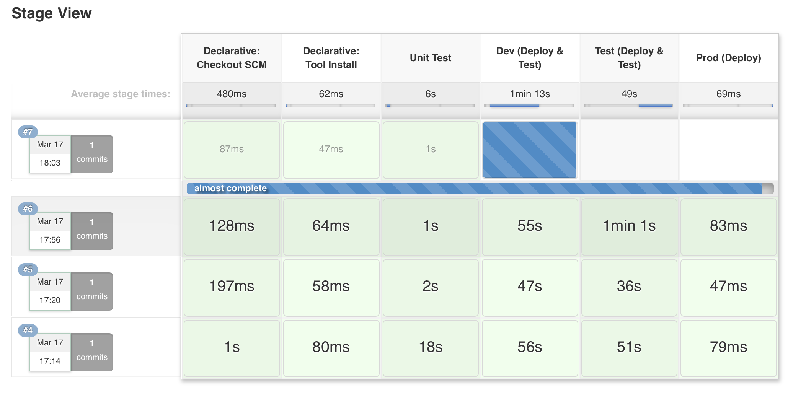

## Prerequisites
* Serverless framework (latest)
* NodeJs
* VS Code (for local debugging)

## Deployment
Install dependencies
```
npm i
```
Deploy the stack to the relevant stage
```
sls deploy -s dev (or appropriate stage name)
```
Update env.js with the api url for test and dev. Ordinarily you would have a known dns name/pattern and this would not be necessary.

## Integration Tests
These are contained in `/test/integration`. They can be run using `npm run integration-dev`. Generally we tend to avoid mocking here so you will be hitting a real dyanmodb table. It is best practice to try not to mock things you don't own as immitating their real behaviour is  error prone and can lead to false positives.

## Unit Tests
These are contained in `/test/unit`. They can be run using `npm run unit`. These are best suited to test some isolated business logic. You will find that integration tests are more usefull and less 'brittle' when shifting to a serverless paradigm as we are often testing small single purpose lambdas that integrate several aws services.

## Local Debugging
### Integration Tests
To debug an integration test locally use the `Test Local Dev` debug target. You can set breakpoints in the test or the lambda function code itself. The test code will bootstrap the handler to allow local debugging.

### Add Hoc Events
To debug a handler with a sample event from cloudwatch logs use the `Invoke Local Dev` target and paste your event in to `api/users/event.json`. Note the body property should be json stringified.

## CI/CD Pipeline
Jenkinsfile at the root defines a multi stage pipeline for this project. The `master` branch deploys from dev through test to prod if all steps succeed. Integration tests run after each deploy (except prod) and validate the deployed stack is functioning as expected. Feature branches `feature/xxx` will also trigger builds and deploys but only as far as test. A pull request to master can then be used to merge changes in to master and release through to prod. This behaviour can be customised as needed.



## todo
* An example of a kinesis handler with integration tests
* Find out why the jenkins multibranch pipeline build plugin doesn't create a seperate job for each branch
* Find out if there is a way to remove steps that arent executed from jenkins gui for a given branch
